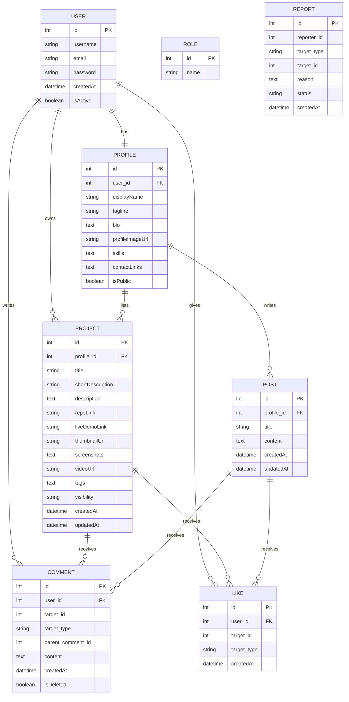

# Portfolio + Project Showcase Platform Requirements

## 1. Overview
A multi-user **portfolio + project showcase** platform with optional blog-like features. Each user has a public portfolio page with a professional bio, projects displayed as cards, a blog (optional), and contact methods. The landing page shows a directory of user profile cards with search and filters for quick discovery.

---

## 2. Project Setup
- **Framework**: Spring Boot (latest stable)  
- **Language**: Java 17+  
- **Build Tool**: Maven or Gradle  
- **Database**: PostgreSQL (recommended) or MySQL  
- **Authentication & Security**: Spring Security with JWT (support for OAuth later)  
- **ORM**: Hibernate / JPA  
- **Image/Asset Storage**: Object storage (S3 / DigitalOcean Spaces) or local storage for initial MVP  
- **Migrations**: Flyway or Liquibase

---

## 3. Core Features

### 3.1 User & Profile
- User registration & login (JWT).  
- Roles: `ROLE_USER`, `ROLE_ADMIN` (and optionally `ROLE_MODERATOR`).  
- Public portfolio page:
  - Professional headshot (profile picture)  
  - Tagline (one-liner)  
  - Full bio (rich text)  
  - Skills (list)  
  - Contact links (email, LinkedIn, GitHub, website)  
  - Contact form (sends email to the user's registered email)  
  - Social links / badges  
- Profile editing & privacy settings (public/private).

### 3.2 Projects
- Projects displayed as **cards** on the user's portfolio page.  
- Card fields: project name, short description, primary tech tag, thumbnail image.  
- Project detail page includes:
  - Full description (rich text)  
  - Repo link(s) (GitHub, GitLab)  
  - Live demo link (if available)  
  - Screenshots gallery  
  - Embedded video (YouTube/Vimeo)  
  - Tags/technologies  
  - Published date / last updated  
- Project visibility: `public`, `private`, or `unlisted` (unlisted accessible via link).

### 3.3 Blog Posts (Optional)
- Users can write posts about projects, case studies, or technical articles.  
- Posts support images, code blocks, and embeds.  
- Posts can be linked to projects (optional relationship).

### 3.4 Interactions
- Comments on projects and posts (threaded or flat).  
- Likes on projects and posts.  
- Report/flag content for moderation.  
- Notifications (in-app or email) for comments/likes (optional).

### 3.5 Discovery & Landing Page
- Landing page with a grid of profile cards (mini picture + tagline + primary tech).  
- Search by name, skill, tag, or technology.  
- Filters for location, availability, or role (optional).  
- Pagination and sorting.

### 3.6 Admin & Moderation
- Admin dashboard: manage users, projects, posts, comments, reports.  
- Soft-delete and restore content.  
- User suspension/ban.

---

## 4. Entities (High-Level)

- **User** (`id`, `username`, `email`, `password`, `roles`, `createdAt`, `isActive`)  
- **Profile** (`id`, `user_id`, `displayName`, `tagline`, `bio`, `profileImageUrl`, `skills`, `contactLinks`, `isPublic`)  
- **Project** (`id`, `profile_id`, `title`, `shortDescription`, `description`, `repoLink`, `liveDemoLink`, `thumbnailUrl`, `screenshots`, `videoUrl`, `tags`, `visibility`, `createdAt`, `updatedAt`)  
- **Post** (`id`, `profile_id`, `title`, `content`, `metadata`, `createdAt`, `updatedAt`)  
- **Comment** (`id`, `user_id`, `post_or_project_id`, `type` (POST/PROJECT), `parentCommentId`, `content`, `createdAt`, `isDeleted`)  
- **Like** (`id`, `user_id`, `post_or_project_id`, `type` (POST/PROJECT), `createdAt`)  
- **Role** (`id`, `name`)  
- **Report** (`id`, `reporter_id`, `target_type`, `target_id`, `reason`, `status`, `createdAt`)

---

## 5. API Endpoints (Suggested)

### Auth
- `POST /api/auth/register` – Register new user  
- `POST /api/auth/login` – Login & receive JWT  
- `POST /api/auth/refresh` – Refresh JWT token  
- `POST /api/auth/verify-email` – Email verification

### Profiles
- `GET /api/profiles` – List public profiles (search & filters)  
- `GET /api/profiles/{id}` – Get public profile by id (or username)  
- `PUT /api/profiles/{id}` – Update profile (owner only)  
- `POST /api/profiles/{id}/contact` – Send message via contact form to profile owner

### Projects
- `GET /api/profiles/{id}/projects` – List projects for profile (paginated)  
- `POST /api/profiles/{id}/projects` – Create project (owner only)  
- `GET /api/projects/{projectId}` – Get project details  
- `PUT /api/projects/{projectId}` – Update project (owner only)  
- `DELETE /api/projects/{projectId}` – Delete project (owner or admin)

### Posts
- `GET /api/posts` – List posts (paginated)  
- `POST /api/posts` – Create post (authenticated)  
- `GET /api/posts/{id}` – Get post details

### Comments & Likes
- `POST /api/{type}/{id}/comments` – Add comment (type = projects|posts)  
- `GET /api/{type}/{id}/comments` – List comments  
- `POST /api/{type}/{id}/like` – Like (or toggle like)  
- `DELETE /api/{type}/{id}/like` – Unlike

### Admin
- `GET /api/admin/reports` – List reports  
- `POST /api/admin/users/{id}/suspend` – Suspend user

---

## 6. Dependencies (Maven coordinates - core)
```xml
<dependencies>
  <dependency>
    <groupId>org.springframework.boot</groupId>
    <artifactId>spring-boot-starter-web</artifactId>
  </dependency>

  <dependency>
    <groupId>org.springframework.boot</groupId>
    <artifactId>spring-boot-starter-data-jpa</artifactId>
  </dependency>

  <dependency>
    <groupId>org.springframework.boot</groupId>
    <artifactId>spring-boot-starter-security</artifactId>
  </dependency>

  <dependency>
    <groupId>org.postgresql</groupId>
    <artifactId>postgresql</artifactId>
    <scope>runtime</scope>
  </dependency>

  <dependency>
    <groupId>org.projectlombok</groupId>
    <artifactId>lombok</artifactId>
    <optional>true</optional>
  </dependency>

  <dependency>
    <groupId>org.springframework.boot</groupId>
    <artifactId>spring-boot-starter-validation</artifactId>
  </dependency>

  <dependency>
    <groupId>io.jsonwebtoken</groupId>
    <artifactId>jjwt-api</artifactId>
    <version>0.11.5</version>
  </dependency>
</dependencies>
```

## 7. Database Schema (ERD - Mermaid)
# Database Schema – Portfolio Platform (MVP)

## Entities

### 1. users
- **user_id** (PK) – UUID / BIGINT (auto)  
- **email** (unique, not null)  
- **password** (hashed, not null)  
- **role** (enum: USER, ADMIN)  
- **created_at** (timestamp)  
- **updated_at** (timestamp)  

---

### 2. profiles
- **profile_id** (PK) – UUID / BIGINT (auto)  
- **user_id** (FK → users.user_id, unique, not null)  
- **tagline** (varchar)  
- **bio** (text)  
- **skills** (json/text)  
- **profile_picture_url** (varchar)  
- **contact_links** (json/text: e.g., GitHub, LinkedIn, Website)  

---

### 3. projects
- **project_id** (PK) – UUID / BIGINT (auto)  
- **user_id** (FK → users.user_id, not null)  
- **title** (varchar, not null)  
- **description** (text)  
- **repo_link** (varchar)  
- **demo_link** (varchar)  
- **screenshot_urls** (json/text)  
- **video_url** (varchar)  
- **created_at** (timestamp)  
- **updated_at** (timestamp)  

---

### 4. comments
- **comment_id** (PK) – UUID / BIGINT (auto)  
- **project_id** (FK → projects.project_id, not null)  
- **user_id** (FK → users.user_id, not null)  
- **content** (text, not null)  
- **created_at** (timestamp)  

---

### 5. likes
- **like_id** (PK) – UUID / BIGINT (auto)  
- **project_id** (FK → projects.project_id, not null)  
- **user_id** (FK → users.user_id, not null)  
- **created_at** (timestamp)  
> Unique constraint: (project_id, user_id)  

---

## Relationships
- **1 User → 1 Profile** (mandatory, one-to-one).  
- **1 User → Many Projects** (one-to-many).  
- **1 Project → Many Comments** (one-to-many).  
- **1 Project → Many Likes** (one-to-many).  
- **1 User → Many Comments** (one-to-many).  
- **1 User → Many Likes** (one-to-many).  



## 8. Security & Non-Functional Requirements
- Passwords stored with BCrypt hashing.
- JWT tokens with refresh tokens.
- Rate limiting on write endpoints (comments, likes, project creation).
- Validation on inputs (size limits, allowed file types for images).
- CORS configuration for frontend domains.
- Logging & monitoring (e.g., centralized logs).
- Backup strategy for DB and uploaded assets.